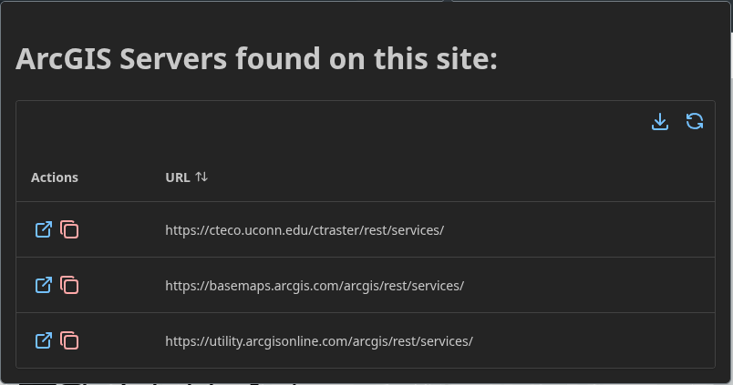

# GeoNet: A web extension to locate web GIS servers providing data to a page!
By filtering through requests a page makes, this extension captures the URL of requests to ArcGIS Rest endpoints and provides them in an easy to view/copy format.





This is a [Plasmo extension](https://docs.plasmo.com/) project bootstrapped with [`plasmo init`](https://www.npmjs.com/package/plasmo).

## Project Roadmap

- v1.0: Detect arcgis rest servers and display them in the list
- v2.0: 
  - Add support for individual layers and their datasources
  - Add support for other GIS server types (geoserver, etc.)


## Developing

### To set up a development server:
```aiignore
pnpm dev
# or
npm dev
```
Open your browser and load the appropriate development build. For example, if you are developing for the chrome browser, using manifest v3, use: `build/chrome-mv3-dev`.
